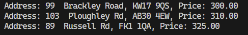
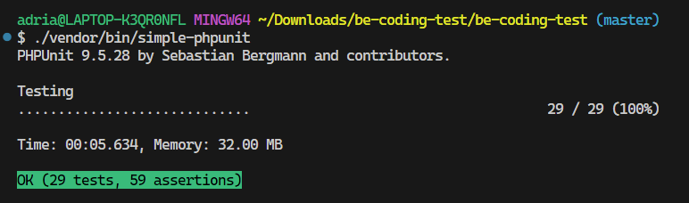

# Goodlord PHP Interview Test

This project is a technical exercise designed to demonstrate the ability to build a service that allows tenants to perform an affordability check against a list of properties. The service is built using Symfony and PHPUnit and involves parsing CSV files, identifying recurring transactions, and calculating affordability based on specific criteria.

## Table of Contents

- [Requirements](#requirements)
- [Project Overview](#project-overview)
- [Installation and Setup](#installation-and-setup)
  - [Starting Docker Containers](#starting-docker-containers)
  - [Installing Dependencies](#installing-dependencies)
- [Running the Affordability Check](#running-the-affordability-check)
- [Accessing the Database](#accessing-the-database)
- [Code Quality Tools](#code-quality-tools)
  - [PHP CS Fixer](#php-cs-fixer)
  - [PHPStan](#phpstan)
- [Running Tests](#running-tests)
- [Limitations and Potential Improvements](#limitations-and-potential-improvements)

## Requirements

To run this project, ensure you have the following installed:

- **PHP** 8.2
- **Symfony** 6.4
- **Composer** 2
- **Docker** 3.4
- **PHPUnit** 9.5
- **PHP CS Fixer** 3.65
- **PHPStan** 2.0

## Project Overview

The application performs an affordability check for a tenant based on their bank statement and a list of properties. It calculates whether the tenant can afford each property by ensuring their monthly recurring income exceeds their monthly recurring expenses by at least **125% of the property's monthly rent**.

### Key Features

- **Bank Statement Parsing**: Reads and processes the tenant's bank statement from a CSV file.
- **Recurring Transaction Detection**: Identifies recurring income and expenses over a two-month period.
- **Affordability Calculation**: Determines which properties the tenant can afford based on their net income.
- **Command-Line Interface**: Provides a Symfony console command for easy execution.
- **Unit Testing**: Includes PHPUnit tests to verify the correctness of the logic.

## Installation and Setup

Clone the repository and navigate to the project directory.

### Starting Docker Containers

The project utilizes Docker for containerization. To start the Docker containers, run:

```bash
# Start Docker containers in detached mode
docker-compose up -d
```

This command will set up the necessary environment, including PHP, a web server, and Adminer for database management.

### Installing dependencies

Install the required PHP dependencies using Composer:

```bash
# Install PHP dependencies
composer install
```

This will install all necessary packages as defined in the composer.json file.

### Running the affordability check

To perform the affordability check, execute the following command:

```bash
# Run the affordability check command
  bin/console app:affordability-check ./files/bank_statement.csv ./files/properties.csv
```

**Parameters:**

- ./files/bank_statement.csv: Path to the tenant's bank statement CSV file.

- ./files/properties.csv: Path to the properties CSV file.

**Final output:**


### Accessing the database
Although a database isn't required for this exercise, an instance of Adminer is included in the Docker setup for potential database interactions or future extensions.

To access Adminer, open your web browser and navigate to:
```bash
  http://localhost:8090/
```

### Code quality tools
To maintain high code quality, the project includes tools like PHP CS Fixer and PHPStan.

### PHP CS FIXER

PHP CS Fixer is used to automatically fix coding standards issues. To run it, execute:
```bash
  # Run PHP CS Fixer on the src directory
  ./vendor/bin/php-cs-fixer fix src
```

### PHPStan

PHPStan is a static analysis tool that helps find bugs in your code. To run PHPStan, use:
```bash
# Run PHPStan analysis on the src directory
./vendor/bin/phpstan analyse src
```

### Running tests

```bash
# Run all PHPUnit tests
./vendor/bin/simple-phpunit
```



### Limitations and potential improvements
- Dynamic Time Frame - Currently, the application is hardcoded to analyze a two-month period. Future versions could dynamically calculate the time frame based on the data.

- Basic CSV parsing: Incorporating a CSV parsing library like League\Csv could enhance error handling and parsing capabilities.

**Thanks you for reading!**